# Chapitre 1 : Dérivation et Variations

**Niveau** : Première (Spécialité Mathématiques)  
**Prérequis** : Fonctions de référence, équations de droites, taux d'accroissement.  
**Objectifs** : 
- Comprendre le concept de nombre dérivé et de tangente.
- Calculer la fonction dérivée des fonctions usuelles.
- Utiliser le signe de la dérivée pour déterminer les variations d'une fonction.

---

## Activités de découverte

**Activité : De la vitesse moyenne à la vitesse instantanée**

Imagine que tu roules 100 km en 1 heure. Ta vitesse **moyenne** est de 100 km/h. Mais cela ne veut pas dire que ton compteur affichait 100 km/h à chaque seconde ! 
Pour connaître ta vitesse **instantanée** à un instant précis $t$, il faut calculer ta vitesse moyenne sur un intervalle de temps minuscule (ex: 0,001 seconde). 
En mathématiques, ce passage d'un intervalle à un point précis s'appelle le **passage à la limite**. C'est ce qui donne naissance au **nombre dérivé**, qui représente la "pente" de la courbe à un instant $t$.

---

## Rappels

Avant de commencer, révise :
- **Taux d'accroissement** : $\frac{f(b) - f(a)}{b - a}$.
- **Équation de droite** : $y = mx + p$.
- **Fonctions de référence** : $x^2, \sqrt{x}, \frac{1}{x}$.

---

## Explications et Théorie

### 1. Le Nombre Dérivé
Soit $f$ une fonction définie sur un intervalle $I$ et $a \in I$.
Le nombre dérivé de $f$ en $a$, noté $f'(a)$, est la limite (si elle existe) du taux de variation quand $h$ tend vers 0 :
$$f'(a) = \lim_{h \to 0} \frac{f(a+h) - f(a)}{h}$$
Graphiquement, $f'(a)$ est le **coefficient directeur de la tangente** à la courbe au point d'abscisse $a$.

### 2. Équation de la Tangente
L'équation de la tangente à la courbe de $f$ au point d'abscisse $a$ est :
$$y = f'(a)(x - a) + f(a)$$

### 3. Fonctions Dérivées Usuelles
| Fonction $f(x)$ | Dérivée $f'(x)$ |
| :--- | :--- |
| $k$ (constante) | $0$ |
| $x^n$ | $nx^{n-1}$ |
| $\frac{1}{x}$ | $-\frac{1}{x^2}$ |
| $\sqrt{x}$ | $\frac{1}{2\sqrt{x}}$ |

### 4. Dérivée et Variations
C'est l'outil le plus puissant de la dérivation :
- Si $f'(x) > 0$ sur un intervalle, alors $f$ est **croissante**.
- Si $f'(x) < 0$ sur un intervalle, alors $f$ est **décroissante**.
- Si $f'(x) = 0$, la fonction admet souvent un **extremum** (maximum ou minimum).

### Méthodes pas-à-pas

**Comment étudier les variations d'une fonction ?**
1. **Calculer la dérivée** $f'(x)$ en utilisant les formules.
2. **Étudier le signe** de $f'(x)$ (souvent en résolvant une équation ou un tableau de signes).
3. **Dresser le tableau de variations** :
   - Placer les valeurs où la dérivée s'annule.
   - Indiquer le signe de la dérivée.
   - Tracer les flèches de variation pour $f$.
4. **Calculer les images** des points importants pour compléter le tableau.

---

## Le saviez-vous ?

La dérivation a été inventée presque en même temps par deux génies au 17ème siècle : **Isaac Newton** en Angleterre et **Gottfried Wilhelm Leibniz** en Allemagne. Ils se sont disputés pendant des années pour savoir qui était le premier ! Aujourd'hui, on utilise la notation de Leibniz ($dy/dx$) et les concepts de Newton pour envoyer des fusées dans l'espace ou prédire les cours de la bourse.

---

## Exercices

### Exercices d'application directe

1. Calcule la dérivée de $f(x) = x^3 + 5x - 2$.
2. Soit $f(x) = x^2$. Calcule le nombre dérivé $f'(3)$.
3. Détermine l'équation de la tangente à la courbe de $f(x) = x^2$ au point d'abscisse 1.

### Exercices d'entraînement

4. **Variations** : Étudie les variations de $f(x) = x^2 - 4x + 1$ sur $\mathbb{R}$.
5. **Produit** : Calcule la dérivée de $g(x) = x \sqrt{x}$ sur $]0 ; +\infty[$.
6. **Quotient** : Calcule la dérivée de $h(x) = \frac{2x+1}{x-3}$ sur $\mathbb{R} \setminus \{3\}$.

### Problèmes ouverts

7. **Optimisation** : On veut fabriquer une boîte sans couvercle à partir d'une feuille carrée de 20 cm de côté en découpant des carrés de côté $x$ aux quatre coins. Quel doit être la valeur de $x$ pour que le volume de la boîte soit maximal ?

---

## Exercices corrigés

**Exercice 1 :**
$f'(x) = 3x^2 + 5$.

**Exercice 2 :**
La dérivée de $x^2$ est $2x$. Donc $f'(3) = 2 \times 3 = \mathbf{6}$.

**Exercice 3 :**
$f(1) = 1^2 = 1$. $f'(1) = 2 \times 1 = 2$.
$y = 2(x - 1) + 1 = \mathbf{2x - 1}$.

**Exercice 4 :**
$f'(x) = 2x - 4$.
$2x - 4 = 0 \implies x = 2$.
La dérivée est négative avant 2 (décroissante) et positive après 2 (croissante). Le minimum est en $x=2$.

**Exercice 5 :**
Utiliser $(uv)' = u'v + uv'$.
$g'(x) = 1 \times \sqrt{x} + x \times \frac{1}{2\sqrt{x}} = \sqrt{x} + \frac{\sqrt{x}}{2} = \mathbf{\frac{3}{2}\sqrt{x}}$.

**Exercice 6 :**
Utiliser $(\frac{u}{v})' = \frac{u'v - uv'}{v^2}$.
$u=2x+1, u'=2$ ; $v=x-3, v'=1$.
$h'(x) = \frac{2(x-3) - (2x+1)(1)}{(x-3)^2} = \frac{2x-6-2x-1}{(x-3)^2} = \mathbf{\frac{-7}{(x-3)^2}}$.

**Exercice 7 :**
Volume $V(x) = x(20-2x)^2 = 4x^3 - 80x^2 + 400x$.
$V'(x) = 12x^2 - 160x + 400$.
On cherche les racines : $\Delta = 6400$. $x_1 = 10$ (impossible) et $x_2 = \mathbf{10/3 \approx 3,33 cm}$.

---

## Synthèse

- **Nombre dérivé** : Pente de la tangente.
- **Formules** : À connaître par cœur ($x^n \to nx^{n-1}$).
- **Signe de $f'$** : Donne les variations de $f$.
- **Tableau** : Outil indispensable pour résumer l'étude.

---

---

## Pour aller plus loin

**La dérivée seconde**
Si on dérive une deuxième fois la fonction ($f''$), on obtient des informations sur la "courbure" de la fonction (concavité). Cela permet de savoir si la courbe se courbe vers le haut (comme un sourire) ou vers le bas (comme une grimace). C'est très utile en physique pour étudier l'accélération.

---

## FAQ

**Q : Pourquoi la dérivée de $\sqrt{x}$ n'existe pas en 0 ?**
**R** : Graphiquement, la tangente en 0 est verticale. Une droite verticale n'a pas de coefficient directeur fini (sa pente est "infinie"). Le nombre dérivé doit être un nombre réel.

**Q : À quoi sert la dérivation dans la vraie vie ?**
**R** : À optimiser ! Trouver le coût minimal de production, la trajectoire la plus rapide pour un satellite, ou le dosage parfait d'un médicament. Dès qu'on cherche un "maximum" ou un "minimum", on utilise la dérivation.

---

## 📝 Mini-Quiz

**Question 1 : Que représente géométriquement le nombre dérivé f'(a) ?**
- [ ] L'aire sous la courbe
- [ ] L'ordonnée à l'origine de la courbe
- [ ] Le coefficient directeur de la sécante
- [x] Le coefficient directeur de la tangente à la courbe au point d'abscisse a
> **Explication :** Le nombre dérivé f'(a) est la limite du taux d'accroissement, ce qui correspond géométriquement à la pente (coefficient directeur) de la tangente.

**Question 2 : Si la dérivée f'(x) est strictement positive sur un intervalle I, alors la fonction f est :**
- [x] Strictement croissante sur I
- [ ] Strictement décroissante sur I
- [ ] Constante sur I
- [ ] Nulle sur I
> **Explication :** Le signe de la dérivée donne les variations de la fonction. Une dérivée positive signifie que la fonction est croissante.

**Question 3 : Quelle est la dérivée de la fonction f(x) = x² ?**
- [ ] f'(x) = x
- [x] f'(x) = 2x
- [ ] f'(x) = 2
- [ ] f'(x) = x³ / 3
> **Explication :** La dérivée de x^n est n*x^(n-1). Pour n=2, la dérivée de x² est 2x.

