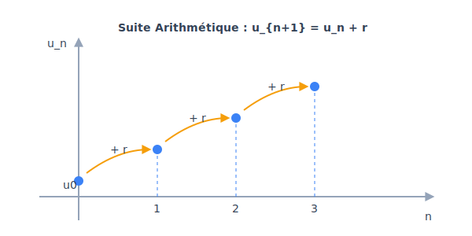

# Chapitre 2 : Suites Numériques

**Niveau** : Première (Spécialité Mathématiques)  
**Prérequis** : Fonctions, pourcentages, puissances.  
**Objectifs** : 
- Modéliser des phénomènes discrets à l'aide de suites.
- Distinguer et utiliser les suites arithmétiques et géométriques.
- Étudier le sens de variation d'une suite.

---

## Activités de découverte

**Activité : L'effet boule de neige**

Si tu places 1000€ sur un livret à 3% par an, combien auras-tu dans 10 ans ? 
Chaque année, les intérêts s'ajoutent au capital, et génèrent eux-mêmes de nouveaux intérêts l'année suivante. C'est le principe des intérêts composés.
Pour modéliser cela, on n'utilise pas une fonction continue $f(x)$ (car la banque ne paie pas d'intérêts à la seconde près), mais une **suite de nombres** indexée par des entiers $n$ (les années) : $u_0, u_1, u_2...$

---

## Rappels

Avant de commencer, révise :
- **Pourcentages** : Augmenter de 3% revient à multiplier par 1,03.
- **Puissances** : $a^n \times a^m = a^{n+m}$.
- **Fonctions** : Une suite est une fonction dont l'ensemble de départ est $\mathbb{N}$.

---

## Explications et Théorie

### 1. Définition d'une suite
Une suite $(u_n)$ est une liste ordonnée de nombres.
- **Formule explicite** : $u_n$ est calculé directement à partir de $n$ (ex: $u_n = 2n + 5$).
- **Relation de récurrence** : On calcule un terme à partir du précédent (ex: $u_{n+1} = u_n^2 - 1$).

### 2. Suites Arithmétiques
On passe d'un terme au suivant en **ajoutant** toujours le même nombre $r$ (la raison).
- **Récurrence** : $u_{n+1} = u_n + r$.
- **Explicite** : $u_n = u_0 + n \times r$.
- **Somme** : $S = \text{nombre de termes} \times \frac{\text{premier} + \text{dernier}}{2}$.

### 3. Suites Géométriques
On passe d'un terme au suivant en **multipliant** toujours par le même nombre $q$ (la raison).
- **Récurrence** : $u_{n+1} = u_n \times q$.
- **Explicite** : $u_n = u_0 \times q^n$.
- **Somme** : $S = \text{premier terme} \times \frac{1 - q^{\text{nb de termes}}}{1 - q}$ (si $q \neq 1$).

### 4. Sens de variation
Pour savoir si une suite monte ou descend, on étudie le signe de $u_{n+1} - u_n$ :
- Si $u_{n+1} - u_n > 0$, la suite est **croissante**.
- Si $u_{n+1} - u_n < 0$, la suite est **décroissante**.

### Méthodes pas-à-pas

**Comment montrer qu'une suite est géométrique ?**
1. Calculer le rapport $\frac{u_{n+1}}{u_n}$.
2. Si ce rapport est un nombre constant (qui ne dépend pas de $n$), alors la suite est géométrique.
3. Ce nombre constant est la raison $q$.

**Comment calculer la somme des premiers termes ?**
1. Identifier s'il s'agit d'une suite arithmétique ou géométrique.
2. Compter le nombre de termes (attention : de $u_0$ à $u_{10}$, il y a 11 termes !).
3. Appliquer la formule correspondante.

---

## Le saviez-vous ?

La suite la plus célèbre au monde est la **suite de Fibonacci** : $1, 1, 2, 3, 5, 8, 13, 21...$ Chaque terme est la somme des deux précédents. On retrouve cette suite partout dans la nature : le nombre de pétales des fleurs, la spirale des coquillages ou la disposition des graines de tournesol. Le rapport entre deux termes consécutifs tend vers le "Nombre d'Or" ($\approx 1,618$).

---

## Exercices

### Exercices d'application directe

1. Soit $(u_n)$ arithmétique avec $u_0 = 5$ et $r = 3$. Calcule $u_{10}$.
2. Soit $(v_n)$ géométrique avec $v_0 = 2$ and $q = 3$. Calcule $v_4$.
3. Calcule la somme $1 + 2 + 3 + ... + 100$.

### Exercices d'entraînement

4. **Variation** : Étudie le sens de variation de $u_n = 3n^2 + 5$.
5. **Placement** : On place 2000€ à 4% par an. On note $u_n$ le capital après $n$ années.
   - Quelle est la nature de la suite $(u_n)$ ?
   - Exprime $u_n$ en fonction de $n$.
   - Quel sera le capital après 10 ans ?
6. **Somme** : Calcule $S = 1 + 2 + 4 + 8 + ... + 1024$.

### Problèmes ouverts

7. **Le nénuphar** : Un nénuphar double de surface chaque jour. Au bout de 30 jours, il recouvre tout l'étang. Au bout de combien de jours recouvrait-il la moitié de l'étang ?

---

## Exercices corrigés

**Exercice 1 :**
$u_{10} = 5 + 10 \times 3 = \mathbf{35}$.

**Exercice 2 :**
$v_4 = 2 \times 3^4 = 2 \times 81 = \mathbf{162}$.

**Exercice 3 :**
$S = 100 \times \frac{1 + 100}{2} = 50 \times 101 = \mathbf{5050}$.

**Exercice 4 :**
$u_{n+1} - u_n = 3(n+1)^2 + 5 - (3n^2 + 5) = 3(n^2 + 2n + 1) - 3n^2 = 6n + 3$.
Comme $n \ge 0$, $6n + 3 > 0$. La suite est **croissante**.

**Exercice 5 :**
- C'est une suite **géométrique** de raison $q = 1,04$.
- $u_n = 2000 \times 1,04^n$.
- $u_{10} = 2000 \times 1,04^{10} \approx \mathbf{2960,49 €}$.

**Exercice 6 :**
C'est la somme d'une suite géométrique de raison 2. $1024 = 2^{10}$, donc il y a 11 termes (de $2^0$ à $2^{10}$).
$S = 1 \times \frac{1 - 2^{11}}{1 - 2} = \frac{1 - 2048}{-1} = \mathbf{2047}$.

**Exercice 7 :**
S'il double chaque jour et qu'il est plein au jour 30, alors il était à moitié plein la veille, soit au **jour 29**.

---

## Synthèse

- **Arithmétique** : On ajoute $r$. $u_n = u_0 + nr$.
- **Géométrique** : On multiplie par $q$. $u_n = u_0 \times q^n$.
- **Variation** : Signe de $u_{n+1} - u_n$.
- **Somme** : Formules spécifiques pour chaque type.

---

## 📝 Mini-Quiz

**Question 1 : Une suite géométrique de raison $q = 0,5$ est toujours décroissante (si $u_0 > 0$).**
- [x] Vrai
- [ ] Faux
> **Explication :** La bonne réponse est : Vrai

**Question 2 : Dans une suite arithmétique, la différence entre deux termes consécutifs est constante.**
- [x] Vrai
- [ ] Faux
> **Explication :** La bonne réponse est : Vrai

**Question 3 : $u_{n+1} = u_n + n$ définit une suite arithmétique.**
- [ ] Vrai
- [x] Faux
> **Explication :** La bonne réponse est : Faux (la raison doit être un nombre fixe, pas dépendre de $n$).

---

## Pour aller plus loin

**Limites de suites**
Que se passe-t-il quand $n$ devient extrêmement grand ? Certaines suites s'approchent d'un nombre précis (on dit qu'elles convergent), d'autres s'envolent vers l'infini. C'est un concept fondamental pour comprendre la continuité et le calcul intégral que tu verras en Terminale.

---

## FAQ

**Q : Pourquoi commence-t-on parfois à $u_0$ et parfois à $u_1$ ?**
**R** : C'est un choix de modélisation. Si $n$ représente une durée écoulée, $u_0$ est l'état initial. Si $n$ représente un rang (le 1er jour, le 2ème jour), on commence souvent à $u_1$. Il faut juste être attentif au nombre de termes !

**Q : Comment reconnaître une suite géométrique dans un énoncé ?**
**R** : Cherche des mots-clés comme "double", "triple", "augmente de x%", "est multiplié par". Si on ajoute une valeur fixe, c'est arithmétique.

---

## Mini-Quiz

1. La raison d'une suite arithmétique où $u_0=2$ et $u_1=5$ est :
   - 2
   - 3
   - 2,5

2. Si $q = 1,05$, la suite géométrique est :
   - Croissante
   - Décroissante
   - Constante

3. Le terme général d'une suite géométrique est :
   - $u_0 + nq$
   - $u_0 \times q^n$
   - $u_0 \times n \times q$

4. $u_{n+1} = 2u_n$ définit une suite :
   - Arithmétique
   - Géométrique
   - De Fibonacci

**Réponses :** 1. 3 | 2. Croissante | 3. $u_0 \times q^n$ | 4. Géométrique
