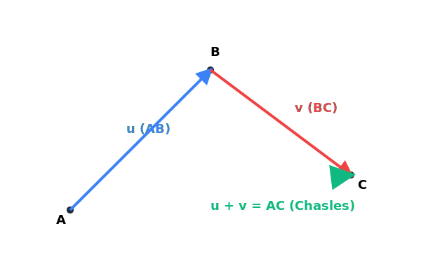

# Chapitre 2 : Vecteurs du Plan

**Niveau** : Seconde  
**Prérequis** : Repérage dans le plan, translations (Collège).  
**Objectifs** : 
- Comprendre la notion de vecteur (direction, sens, norme).
- Additionner des vecteurs (Relation de Chasles).
- Lire et calculer les coordonnées d'un vecteur.
- Utiliser la colinéarité pour prouver un alignement ou un parallélisme.

---

## Activités de découverte

**Activité : Le déplacement du drone**

Imagine un drone qui doit se déplacer d'un point A à un point B. Pour programmer ce déplacement, l'ordinateur de bord a besoin de 3 informations :
1. L'inclinaison de la trajectoire (la **direction**).
2. Vers où on va sur cette trajectoire (le **sens**).
3. La distance à parcourir (la **norme**).

Cet ensemble d'informations forme un objet mathématique appelé le **vecteur**, noté $\vec{AB}$.

1. Si le drone se déplace de A vers B, puis de B vers C, quel est le déplacement total ?
2. Comment pourrais-tu noter ce déplacement global ?
3. Si deux drones font le même déplacement (même direction, même sens, même distance) mais partent de points différents, peut-on dire qu'ils ont le même vecteur ?

---

## Rappels

Avant de commencer, révise :
- **Translation** : Glissement d'une figure sans la faire tourner.
- **Parallélogramme** : Quadrilatère dont les côtés opposés sont parallèles et de même longueur.
- **Coordonnées** : $M(x ; y)$ dans un repère.

---

## Explications et Théorie

### 1. Définition d'un vecteur
Un vecteur $\vec{u}$ est défini par :
- Une **direction** (la droite qui le porte).
- Un **sens** (indiqué par la flèche).
- Une **norme** (sa longueur, notée $||\vec{u}||$).

### 2. Égalité et Parallélogramme
Deux vecteurs sont égaux s'ils ont la même direction, le même sens et la même norme.
- $\vec{AB} = \vec{CD} \iff ABDC$ est un parallélogramme.

### 3. Somme de vecteurs
- **Relation de Chasles** : Pour tous points $A, B, C$, on a $\vec{AB} + \vec{BC} = \vec{AC}$.
- **Règle du parallélogramme** : $\vec{AB} + \vec{AD} = \vec{AC}$ si $ABCD$ est un parallélogramme.

### 4. Coordonnées d'un vecteur
Dans un repère $(O; I, J)$, si $A(x_A ; y_A)$ et $B(x_B ; y_B)$, alors :
$$\vec{AB} \begin{pmatrix} x_B - x_A \\ y_B - y_A \end{pmatrix}$$
- **Somme** : Les coordonnées de $\vec{u} + \vec{v}$ sont la somme des coordonnées de $\vec{u}$ et $\vec{v}$.
- **Norme** : $||\vec{u}|| = \sqrt{x^2 + y^2}$.

### 5. Colinéarité
Deux vecteurs $\vec{u}$ et $\vec{v}$ sont colinéaires s'il existe un réel $k$ tel que $\vec{v} = k\vec{u}$.
- **Critère** : $\vec{u}\begin{pmatrix} x \\ y \end{pmatrix}$ et $\vec{v}\begin{pmatrix} x' \\ y' \end{pmatrix}$ sont colinéaires si $xy' - yx' = 0$.
- **Applications** : Prouver que deux droites sont parallèles ou que trois points sont alignés.

### Méthodes pas-à-pas

**Comment montrer que trois points A, B, C sont alignés ?**
1. Calculer les coordonnées des vecteurs $\vec{AB}$ et $\vec{AC}$.
2. Vérifier si ces deux vecteurs sont colinéaires (en calculant le déterminant $xy' - yx'$).
3. Si le déterminant est nul, les vecteurs sont colinéaires. Comme ils ont le point A en commun, les points A, B, C sont alignés.

---

## Le saviez-vous ?

Le mot "vecteur" vient du latin *vehere*, qui signifie "transporter". En biologie, on utilise aussi ce mot pour désigner un organisme (comme un moustique) qui "transporte" une maladie d'un individu à un autre. En mathématiques, le vecteur "transporte" un point vers sa nouvelle position !

---

## Exercices

### Exercices d'application directe

1. Soit $A(1 ; 2)$ and $B(4 ; 6)$. Calcule les coordonnées de $\vec{AB}$.
2. Calcule la norme du vecteur $\vec{u} \begin{pmatrix} 3 \\ 4 \end{pmatrix}$.
3. Simplifie $\vec{AB} + \vec{BC} + \vec{CA}$.

### Exercices d'entraînement

4. **Parallélogramme** : Soit $A(0 ; 0)$, $B(3 ; 1)$ et $C(4 ; 4)$. Trouve les coordonnées de $D$ pour que $ABCD$ soit un parallélogramme.
5. **Colinéarité** : Les vecteurs $\vec{u} \begin{pmatrix} 2 \\ -3 \end{pmatrix}$ et $\vec{v} \begin{pmatrix} -4 \\ 6 \end{pmatrix}$ sont-ils colinéaires ?
6. **Alignement** : Les points $A(1 ; 1)$, $B(3 ; 2)$ et $C(7 ; 4)$ sont-ils alignés ?

### Problèmes ouverts

7. **Le milieu** : Démontre que si $M$ est le milieu de $[AB]$, alors $\vec{MA} + \vec{MB} = \vec{0}$.

---

## Exercices corrigés

**Exercice 1 :**
$\vec{AB} \begin{pmatrix} 4 - 1 \\ 6 - 2 \end{pmatrix} = \mathbf{\begin{pmatrix} 3 \\ 4 \end{pmatrix}}$.

**Exercice 2 :**
$||\vec{u}|| = \sqrt{3^2 + 4^2} = \sqrt{9 + 16} = \sqrt{25} = \mathbf{5}$.

**Exercice 3 :**
$\vec{AB} + \vec{BC} = \vec{AC}$. Puis $\vec{AC} + \vec{CA} = \vec{AA} = \mathbf{\vec{0}}$.

**Exercice 4 :**
$ABCD$ est un parallélogramme $\iff \vec{AB} = \vec{DC}$.
$\vec{AB} \begin{pmatrix} 3 \\ 1 \end{pmatrix}$. $\vec{DC} \begin{pmatrix} 4 - x_D \\ 4 - y_D \end{pmatrix}$.
$4 - x_D = 3 \implies x_D = 1$. $4 - y_D = 1 \implies y_D = 3$.
$\mathbf{D(1 ; 3)}$.

**Exercice 5 :**
$2 \times 6 - (-3) \times (-4) = 12 - 12 = 0$. **Oui**, ils sont colinéaires.

**Exercice 6 :**
$\vec{AB} \begin{pmatrix} 2 \\ 1 \end{pmatrix}$. $\vec{AC} \begin{pmatrix} 6 \\ 3 \end{pmatrix}$.
$2 \times 3 - 1 \times 6 = 0$. **Oui**, ils sont alignés.

**Exercice 7 :**
Si $M$ est le milieu, $\vec{MA}$ et $\vec{MB}$ ont la même direction, la même norme mais des sens opposés. Donc $\vec{MA} = -\vec{MB}$, ce qui donne $\vec{MA} + \vec{MB} = \vec{0}$.

---

## Synthèse

- **Vecteur** : Direction, sens, norme.
- **Chasles** : $\vec{AB} + \vec{BC} = \vec{AC}$.
- **Coordonnées** : $\vec{AB} (x_B-x_A ; y_B-y_A)$.
- **Colinéarité** : $xy' - yx' = 0$.

---

## 📝 Mini-Quiz

**Question 1 : Deux vecteurs colinéaires sont forcément égaux.**
- [ ] Vrai
- [x] Faux
> **Explication :** La bonne réponse est : Faux (ils peuvent avoir des normes ou des sens différents)

**Question 2 : Le vecteur nul $\vec{0}$ a pour coordonnées $(0 ; 0)$.**
- [x] Vrai
- [ ] Faux
> **Explication :** La bonne réponse est : Vrai

**Question 3 : La relation de Chasles ne s'applique qu'aux points alignés.**
- [ ] Vrai
- [x] Faux
> **Explication :** La bonne réponse est : Faux (elle s'applique à n'importe quels points).

---

## Pour aller plus loin

**Les vecteurs en physique**
En physique, on utilise les vecteurs pour représenter des forces (comme la gravité), des vitesses ou des accélérations. Quand plusieurs forces s'exercent sur un objet, la force résultante est simplement la **somme vectorielle** de toutes ces forces. C'est grâce à ces calculs que l'on peut prévoir la trajectoire d'un avion ou la stabilité d'un pont !

---

## FAQ

**Q : Quelle est la différence entre $\vec{AB}$ et $\vec{BA}$ ?**
**R** : Ils ont la même direction et la même norme, mais des **sens opposés**. On dit que $\vec{BA}$ est le vecteur opposé de $\vec{AB}$. On note $\vec{BA} = -\vec{AB}$.

**Q : Pourquoi le déterminant doit-il être nul pour la colinéarité ?**
**R** : Parce que cela signifie que les coordonnées sont proportionnelles. Si $x/x' = y/y'$, alors $xy' = x'y$, donc $xy' - x'y = 0$.

---

## Mini-Quiz

1. Si $\vec{u} = \vec{v}$, alors ils ont :
   - La même direction
   - Le même sens
   - La même direction, le même sens et la même norme

2. Le vecteur $\vec{AB} + \vec{BA}$ est égal à :
   - $2\vec{AB}$
   - $\vec{0}$
   - $\vec{AA}$

3. Deux vecteurs colinéaires ont des directions :
   - Perpendiculaires
   - Parallèles
   - Quelconques

4. La norme de $\vec{u} \begin{pmatrix} 1 \\ 1 \end{pmatrix}$ est :
   - 1
   - 2
   - $\sqrt{2}$

**Réponses :** 1. La même direction, le même sens et la même norme | 2. $\vec{0}$ | 3. Parallèles | 4. $\sqrt{2}$
