# Chapitre 1 : Nombres Complexes

**Niveau** : Post-Bac (CPGE, Licence)  
**Prérequis** : Trigonométrie, polynômes, géométrie plane.  
**Objectifs** : 
- Maîtriser les différentes formes d'un nombre complexe (algébrique, trigonométrique, exponentielle).
- Résoudre des équations polynomiales dans $\mathbb{C}$.
- Utiliser les complexes en géométrie.

---

## Activités de découverte

**Activité : L'invention de $i$**

Historiquement, les mathématiciens ont été bloqués par des équations du type $x^2 + 1 = 0$, qui n'ont pas de solution dans l'ensemble des réels $\mathbb{R}$.

1. Pourquoi $x^2 + 1 = 0$ n'a pas de solution réelle ?
2. Si on définit un nombre imaginaire $i$ tel que $i^2 = -1$, quelles sont les solutions de $x^2 + 1 = 0$ ?
3. Peux-tu trouver les solutions de $x^2 + 4 = 0$ en utilisant $i$ ?

---

## Rappels

Avant de commencer, révise :
- **Trigonométrie** : Cercle trigonométrique, $\cos(\theta)$ and $\sin(\theta)$.
- **Second degré** : Discriminant $\Delta = b^2 - 4ac$.
- **Vecteurs** : Coordonnées et produit scalaire dans le plan.

---

## Explications et Théorie

### 1. Forme algébrique
Un nombre complexe $z$ s'écrit $z = a + ib$ avec $a, b \in \mathbb{R}$.
- $a = \text{Re}(z)$ (Partie réelle).
- $b = \text{Im}(z)$ (Partie imaginaire).
- **Conjugué** : $\bar{z} = a - ib$.
- **Module** : $|z| = \sqrt{a^2 + b^2}$.

### 2. Forme trigonométrique et exponentielle
Pour $z \neq 0$ :
- **Forme trigonométrique** : $z = r(\cos \theta + i \sin \theta)$.
- **Forme exponentielle** : $z = r e^{i\theta}$.
Où $r = |z|$ et $\theta = \arg(z) \pmod{2\pi}$.

### 3. Opérations et propriétés
- $e^{i\theta} \times e^{i\theta'} = e^{i(\theta+\theta')}$.
- $(e^{i\theta})^n = e^{in\theta}$ (**Formule de Moivre**).
- $\cos \theta = \frac{e^{i\theta} + e^{-i\theta}}{2}$ and $\sin \theta = \frac{e^{i\theta} - e^{-i\theta}}{2i}$ (**Formules d'Euler**).

## 🎨 Animation Interactive : Le Plan Complexe (Forme d'Euler)
Observe le fascinant voyage continu du vecteur $z = e^{i\theta}$ sur le cercle de rayon $1$. À chaque instant, sa projection sur l'axe horizontal trace le Cosinus (la Partie Réelle), et sur l'axe vertical, le Sinus (la Partie Imaginaire).

### 4. Équations du second degré
Dans $\mathbb{C}$, si $\Delta < 0$, l'équation $az^2 + bz + c = 0$ admet deux solutions complexes conjuguées :
$$z = \frac{-b \pm i\sqrt{-\Delta}}{2a}$$

### Méthodes pas-à-pas

**Comment passer de la forme algébrique à la forme exponentielle ?**
1. Calculer le module $r = \sqrt{a^2 + b^2}$.
2. Factoriser $z$ par $r$ : $z = r(\frac{a}{r} + i\frac{b}{r})$.
3. Identifier $\theta$ tel que $\cos \theta = \frac{a}{r}$ et $\sin \theta = \frac{b}{r}$ à l'aide du cercle trigonométrique.
4. Écrire $z = r e^{i\theta}$.

---

## 💡 Le savais-tu ?

L'identité mythique d'Euler, $e^{i\pi} + 1 = 0$, est considérée mondialement comme "la plus belle formule des mathématiques". Elle relie avec une pureté absolue cinq des constantes fondamentales de l'univers géométrique et algébrique en une seule égalité très condensée :
- **0** (l'élément neutre de l'addition du rien),
- **1** (la base de toute multiplication),
- **$\pi$** (le rapport infini d'un cercle, l'âme de la géométrie pure),
- **$e$** (la base de l'exponentielle, le coeur de l'analyse et de l'inflation),
- **$i$** (la racine fictive du nombre négatif, l'âme de l'algèbre imaginaire).  
Cette ligne est un pont magique entre des champs scientifiques qui opéraient initialement en s'ignorant totalement !

---

## Exercices

**🟢 Exercice A (Le Rituel de Base)**
1. **Opérations brutes** : Soit l'entité complexe $z = 3 - 4i$. Calcule vigoureusement son module absolu $|z|$ ainsi que son grand miroir conjugué $\bar{z}$.
2. **Translation Exponentielle** : Mute le basique $z = 1 + i$ depuis la forme algébrique vers la puissante forme exponentielle (en utilisant le Cosinus et son rayon).
3. **Le Mur du Second Degré** : Résous la funeste $z^2 + z + 1 = 0$ au sein de $\mathbb{C}$.

**🔵 Exercice B (Mécanique Analytique Avancée)**
4. **La Puissance de Moivre** : Réalise un calcul de force : $(1+i)^{10}$. *(Astuce d'expert : Jamais de produit algébrique long ! Passe immédiatement par sa forme exponentielle générée en Question 2 !)*.
5. **Distance pure dans le Plan Complexe** : Soit un point affixe $A(1+i)$ et son ami de cible $B(3+2i)$. Demande formelle : Calcule au micromètre près la distance algébrique $AB$.
6. **Linéarisation mortelle** : Grâce aux formidables Outils du Maître Euler, exprime purement $\cos^2(x)$ strictement en fonction d'un $\cos(2x)$.

**🟠 Exercice C (Problèmes Universitaires Ouverts)**
7. **Les Racines de l'Unité (Polynômes pures)** : Traque impitoyablement tous les mystérieux nombres complexes $z$ satisfaisant l'ordre d'annulation $z^3 = 1$. Trace cette matrice de solutions sur le plan visuel complexe (l'écran radar). Demande finale : Quelle est la configuration géométrique de ce tracé absolu de l'Unité ?

---

## Exercices corrigés

**Exercice 1 :**
$|z| = \sqrt{3^2 + (-4)^2} = \sqrt{25} = \mathbf{5}$. $\bar{z} = \mathbf{3 + 4i}$.

**Exercice 2 :**
$r = \sqrt{1^2 + 1^2} = \sqrt{2}$. $z = \sqrt{2}(\frac{1}{\sqrt{2}} + i\frac{1}{\sqrt{2}}) = \sqrt{2}(\cos \frac{\pi}{4} + i \sin \frac{\pi}{4})$.
$\mathbf{z = \sqrt{2} e^{i\pi/4}}$.

**Exercice 3 :**
$\Delta = 1^2 - 4 = -3$. Les solutions sont $\mathbf{z = \frac{-1 \pm i\sqrt{3}}{2}}$.

**Exercice 4 :**
$1+i = \sqrt{2}e^{i\pi/4}$. $(1+i)^{10} = (\sqrt{2})^{10} e^{i 10\pi/4} = 32 e^{i 5\pi/2} = 32 e^{i\pi/2} = \mathbf{32i}$.

**Exercice 5 :**
$AB = |z_B - z_A| = |(3+2i) - (1+i)| = |2+i| = \sqrt{2^2 + 1^2} = \mathbf{\sqrt{5}}$.

**Exercice 6 :**
$\cos^2(x) = (\frac{e^{ix} + e^{-ix}}{2})^2 = \frac{e^{2ix} + 2 + e^{-2ix}}{4} = \frac{2\cos(2x) + 2}{4} = \mathbf{\frac{1 + \cos(2x)}{2}}$.

**Exercice 7 :**
$z^3 = 1 \iff z = e^{i 2k\pi/3}$ pour $k \in \{0, 1, 2\}$.
Les solutions sont $1$, $e^{i2\pi/3}$ and $e^{i4\pi/3}$. Ils forment un **triangle équilatéral** inscrit dans le cercle unité.

---

## Synthèse

- **Algébrique** : $a+ib$.
- **Exponentielle** : $r e^{i\theta}$.
- **Conjugué** : Symétrie par rapport à l'axe réel.
- **Module** : Distance à l'origine.
- **Euler** : Lien entre exponentielle et trigonométrie.

---

---

## Pour aller plus loin

**Les fractales de Mandelbrot**
L'ensemble de Mandelbrot est l'une des figures les plus célèbres des mathématiques. Il est défini par une suite de nombres complexes : $z_{n+1} = z_n^2 + c$. Si la suite reste bornée, le nombre $c$ appartient à l'ensemble. Cette définition très simple engendre une complexité infinie et des images d'une beauté fascinante, montrant la puissance des nombres complexes pour modéliser le chaos et l'auto-similarité.

---

## Foire Aux Questions (FAQ) Étudiante

  
Pourquoi est-ce que mon Tuteur de Physique Électrique a transformé tous ses "i" en "j" sur le tableau ? Est-il devenu fou ?

  Ton tuteur est sain d'esprit ! En ingénierie et signaux électriques, une consigne internationale bloque farouchement la lettre minusucle $i$ (et $I$) pour représenter l'Intensité vitale du Courant. Utiliser $i$ comme nombre imaginaire en plus dans une formule sur le courant créerait une apocalypse d'erreurs monumentales. Ils ont donc simplement pris la lettre suivante : le fameux $j$. Sois sans crainte : C'est un pur clône exact, $j^2 = -1$.

  
Quand est-ce qu'un nombre est jugulé en tant qu'entité "Imaginaire Pure"  ?

  Un Complexe total a logiquement une équerre : C'est comme une adresse (Nord/Sud, Est/Ouest). S'il est qualifié "Imaginaire pur", c'est que la cible ne marche PLUS DU TOUT vers l'Est / Ouest (le Réel est effacé : $a=0$). Il s'écrit purement $z = ib$. C'est un oiseau qui s'envole uniquement sur l'axe ascenseur. S'il était uniquement réel, sa partie $b = 0$, et c'est le cas banal du Lycée.

---

## 📝 Mini-Quiz

**Question 1 : Le reflet parfait "Conjugué" d'un complexe z = -3 + 4i est la matrice :**
- [ ] 3 - 4i
- [x] -3 - 4i
- [ ] 3 + 4i
> **Explication :** Strictement B ! La définition solennelle d'un Conjugué stipule que SEULE sa Partie Imaginaire (son Élévation) s'inverse majestueusement ! Le bout ancré dans le réel ne bouge pas. Ainsi le signe -3 du réel reste roc (-3), le 4 d'envol se brise en plongeon (-4).

**Question 2 : Le module d'acier pur de notre z = 3 + 4i pèse quel nombre en géométrie ?**
- [ ] 7
- [x] 5
- [ ] 25
> **Explication :** Le module n'est nul autre que l'Application d'une force antique nommée Pythagore ! Racine stricte des carrés des colonnes. √(3² + 4²) = √(9+16) = √25 = 5 pur. L'Hypoténuse d'or !

**Question 3 : Comment encoder rapidement z = 2i pour un robot qui lit l'art exponentiel ?**
- [ ] $2e^{i\pi}$
- [x] $2e^{i\pi/2}$
- [ ] $e^{2i}$
> **Explication :** "2i" indique à l'expert deux choses. La longueur c'est un double de rayonnage (2). L'angle (i imaginaire total) prouve que tu regardes plein Nord à 90°. L'angle de 90° pure se code en radians massifs $\pi/2$. D'où l'identité exponentielle.

---

## ✅ Checklist des Essentiels (Validation)

- [ ] Je maîtrise les définitions clés de ce chapitre.
- [ ] Je sais appliquer les méthodes fondamentales présentées.
- [ ] J'ai résolu les exercices pratiques d'entraînement.
- [ ] J'ai complété le mini-quiz du chapitre avec succès.

*(Fin des Abysses Construits de Nombres)*