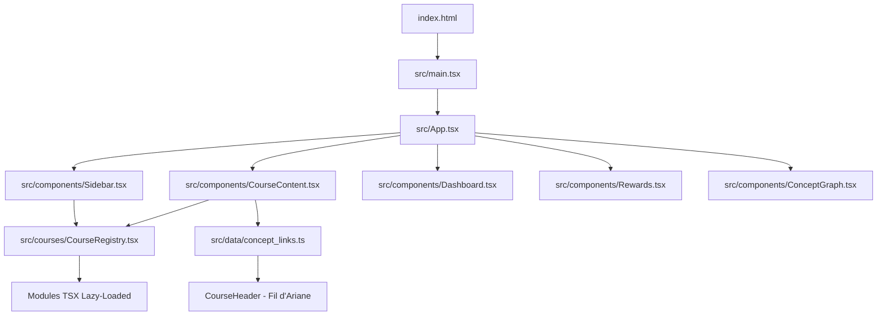

# 🛠️ Guide de Développement (readme-dev.md)

Ce document explique en détail la conception technique, l'architecture logicielle et les choix de conception de la plateforme interactive de mathématiques.

---

## 🏛️ Architecture Générale

L'application est une **Single Page Application (SPA) 100% Client-Side** (Frontend-only, prête pour un backend futur). Elle est construite avec **React 19**, **TypeScript 5+** (mode strict) et **Vite**.



### Principes Directeurs

1. **Zéro Backend Actif** : Toutes les données (XP, badges, progression, streaks) vivent dans `localStorage`.
2. **Modularité et Performance** : 215 chapitres compilés comme chunks séparés, chargés à la demande (Lazy Loading).
3. **Typage Strict** : Aucun `any`. Règles de typage très strictes sur les props SharedUI (voir `AGENTS.md`).
4. **Double format de cours** : TSX (interactif, lab visuel) + Markdown (fiche statique via `rehype-katex`).

---

## 📂 Organisation du Code Source

```
src/
├── App.tsx                    # Layout principal, états globaux, routage
├── main.tsx                   # Point d'entrée — BrowserRouter + basename="/guide-maths"
├── index.css                  # Tailwind CSS v4 (@import "tailwindcss")
│
├── components/
│   ├── SharedUI.tsx            # ★ Bibliothèque UI obligatoire (Section, Quiz, Flashcard…)
│   ├── MathComponent.tsx       # Moteur KaTeX sécurisé
│   ├── Sidebar.tsx             # Navigation hiérarchique + recherche sémantique
│   ├── CourseContent.tsx       # Rendu dynamique TSX + Markdown, CourseContext.Provider
│   ├── ConceptGraph.tsx        # Graphe SVG interactif (zoom/pan), route /graph
│   ├── Dashboard.tsx           # Tableau de bord XP, graphiques d'activité
│   ├── Rewards.tsx             # Badges, mini-jeux, énigmes secrètes
│   └── Settings.tsx            # Profil local, avatar, import/export JSON
│
├── courses/
│   └── CourseRegistry.tsx      # Registre lazy des ~142 composants TSX
│
├── data/
│   ├── concept_links.ts        # ★ Graphe pédagogique : dépendances inter-cours
│   └── courses_index.json      # ★ Index auto-généré (scripts/generate_index.ts)
│
├── hooks/
│   ├── useProgress.ts          # XP, niveaux, badges, streaks (localStorage)
│   ├── useLocalAccount.ts      # Compte local, notes, avatar
│   └── useCourses.ts           # Fetch asynchrone des fiches Markdown
│
└── utils/
    ├── search.ts               # Dictionnaire sémantique mots-clés → IDs cours
    └── sound.ts                # Synthèse sonore Web Audio API (célébrations)

scripts/
├── generate_index.ts           # Régénère courses_index.json depuis le filesystem
├── check_completeness.js       # Audit des cours TSX incomplets
├── check_dependencies.js       # Vérifie qu'aucune dépendance n'est pendante
└── find_missing_links.js       # Liste les cours sans entrée dans concept_links.ts

Cours_Math/                     # Fiches Markdown statiques
├── 01_Maternelle/
├── 02_College/
├── 03_Lycee/
└── 04_Post_Bac/                # 79 fichiers MD, dont 62 non encore dans concept_links
```

---

## 📐 Rendu LaTeX et KaTeX (Règle `AGENTS.md`)

Pour afficher des formules en inline (`$ ... $`) ou block (`$$ ... $$`), le projet utilise `rehype-katex` + `react-markdown`.

> [!CAUTION]
> **Règle absolue d'échappement JSX** :
> Les accolades `{ }` dans une formule math en JSX provoquent une erreur fatale de compilation.
>
> * **Incorrect** : `<Flashcard front={<>L'inverse de $\frac{3}{5}$ ...</>} />`
> * **Correct** : `<Flashcard front={<>L'inverse de {"$\\frac{3}{5}$"} ...</>} />`
> * **Recommandé** : `<MathComponent math="\\frac{3}{5}" />`

---

## 🔗 Système de Fil d'Ariane Pédagogique (Concept Pedigree)

### Fonctionnement

Chaque cours peut afficher dans son `<CourseHeader>` :
- 🌱 **"Prend racine dans"** : ses prérequis (parents dans le graphe)
- 🌸 **"Fleurira dans"** : les cours qui en dépendent (enfants)

### Architecture

```
concept_links.ts
  └─ CONCEPT_METADATA : Record<courseId, { domain, shortTitle, dependencies[] }>

CourseContent.tsx
  └─ CourseContext.Provider (value = courseId courant)
       └─ [composant TSX du cours]
            └─ <CourseHeader> (lit le contexte, résout parents/enfants depuis CONCEPT_METADATA)
```

### Contraintes strictes

- Les IDs dans `dependencies[]` **doivent exister comme clés** dans `CONCEPT_METADATA`
- Les IDs **doivent correspondre** à un fichier dans `courses_index.json`
- Jamais de liens écrits en dur dans les fichiers TSX individuels

### État actuel (juin 2026)
- **64 nœuds** dans le graphe, **0 dépendance pendante**
- **62 cours Post-Bac** non encore intégrés → voir `rodo.md` (Lots A à I)

---

## 🗂️ `courses_index.json` — Structure et Génération

Ce fichier est **auto-généré** par `npx tsx scripts/generate_index.ts`.  
**Ne jamais l'éditer à la main.** Tout ajout de fichier dans `Cours_Math/` sera capté au prochain build.

Structure d'une entrée :
```json
{
  "id": "/Cours_Math/04_Post_Bac/BTS/01_BTS_01_Graphes_et_Reseaux.md",
  "title": "BTS : Graphes et Réseaux",
  "level": "Post_Bac",
  "subLevel": "BTS",
  "order": 1
}
```

L'ID est **le chemin relatif à la racine du projet** (utilisé comme clé dans `concept_links.ts`).

---

## 🎮 Système de Gamification

```
useProgress.ts
├── XP : cumulé par validation de cours (+20 à +60 XP selon le niveau)
├── Niveau : calculé dynamiquement (Apprenti → Expert → Maître…)
├── Badges : débloqués automatiquement selon seuils (premiers cours, séries…)
└── Streaks : jours consécutifs d'activité (remis à zéro si 24h sans session)
```

Le Dashboard affiche des graphiques de progression hebdomadaire (composant SVG natif, sans dépendance externe).

---

## 📱 PWA (Progressive Web App)

L'application utilise `vite-plugin-pwa` pour :
1. Générer `manifest.webmanifest` (noms, couleurs, icônes)
2. Enregistrer un Service Worker en mode **autoUpdate** (mise à jour transparente)
3. Mettre en cache les fichiers statiques + les fiches Markdown de `/Cours_Math/`
4. Permettre l'installation native sur Android/iOS/desktop

---

## 🔍 Scripts de Diagnostic

| Commande | Rôle |
|---|---|
| `npm run dev` | Serveur dev sur port 3000 |
| `npm run lint` | `tsc --noEmit` — validation TypeScript |
| `npm run build` | Lint + génération du bundle `dist/` |
| `npx tsx scripts/generate_index.ts` | Régénère `courses_index.json` |
| `npx tsx scripts/check_completeness.js` | Audit des cours TSX incomplets |
| `node scripts/check_dependencies.js` | Vérifie l'intégrité du graphe pédagogique |
| `node scripts/find_missing_links.js` | Liste les cours absents de `concept_links.ts` |

---

## 🚀 Workflow Git

```bash
# Développement standard
git add <fichiers>
git commit -m "feat/fix/docs: description courte"
git push origin main

# Initialisation (première fois)
git remote add origin git@github.com:Hylst/guide-maths.git
git branch -M main
git push -u origin main
```

> [!WARNING]
> **PowerShell** ne supporte pas `&&` pour chaîner des commandes.
> Utiliser des commandes séquentielles séparées, ou lancer depuis Git Bash.

---

## 📐 Rendu des Composants Markdown dans CourseContent

Les fiches Markdown (`/Cours_Math/**/*.md`) sont rendues avec :

```tsx
<ReactMarkdown
  remarkPlugins={[remarkMath]}
  rehypePlugins={[rehypeKatex]}
  components={{ /* overrides de balises HTML → composants React */ }}
>
  {markdownContent}
</ReactMarkdown>
```

Le routage : l'URL `/cours/04_Post_Bac/BTS/01_...md` est transformée en
`/Cours_Math/04_Post_Bac/BTS/01_...md` par `App.tsx` pour le fetch.

---

## 🎨 Contraintes de Typages et Couleurs (SharedUI)

| Composant | Prop | Valeurs autorisées |
|---|---|---|
| `<Section>` | `color` | `"slate" \| "indigo" \| "emerald" \| "amber" \| "rose" \| "blue" \| "purple"` |
| `<InfoBlock>` | `type` | `"info" \| "warning" \| "definition" \| "funfact" \| "reminder"` |
| `<TipBanner>` | `type` | `"info" \| "warning" \| "success"` |

Toute autre valeur provoquera une **erreur de compilation TypeScript**.
