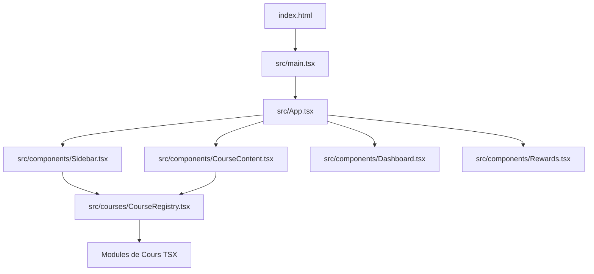

# 🛠️ Guide de Développement (readme-dev.md)

Ce document explique en détail la conception technique, l'architecture logicielle et les choix de conception de la plateforme interactive de mathématiques.

---

## 🏛️ Architecture Générale

L'application est une **Single Page Application (SPA) 100% Client-Side** (Frontend-only pour le moment, mais prête pour un backend). Elle est construite avec **React 19**, **TypeScript** (mode strict) et **Vite**.

### Principes Directeurs
1. **Zéro Backend Actif** : Toutes les données d'apprentissage (XP, badges, progression, séries d'études) sont gérées localement.
2. **Modularité et Performance** : Plus de 120 chapitres de cours sont compilés comme des chunks séparés et chargés à la demande (Lazy Loading) grâce au registre dynamique.
3. **Typage Strict et Sécurité** : Pas d'usage du type `any`. Respect des directives typographiques strictes pour éviter les plantages lors du rendu de formules complexes.

---

## 📂 Organisation du Code Source

* **`src/main.tsx`** : Point d'entrée de l'application. Enveloppe `<App />` avec le `<BrowserRouter>` en configurant le chemin de base (`basename="/guide-maths"`).
* **`src/App.tsx`** : Layout principal. Gère les états globaux (thème sombre, ouverture des modales, chargement des cours) et le routage principal (Tableau de bord, Récompenses, Glossaire).
* **`src/components/`** :
  * **`Sidebar.tsx`** : Menu de navigation hiérarchique (Cycles scolaires, Catégories Post-Bac, sous-niveaux) intégrant la recherche par mots-clés.
  * **`CourseContent.tsx`** : Rendu dynamique des cours. Gère à la fois le chargement des composants TSX autonomes (les laboratoires réactifs) et l'affichage des fiches Markdown statiques via `react-markdown` + `rehype-katex`.
  * **`Dashboard.tsx`** : Tableau de bord de l'élève affichant les statistiques, la progression globale, et les graphiques d'activité hebdomadaire.
  * **`Rewards.tsx`** : Système de gamification (badges débloqués, mini-jeu de calcul mental, énigmes mathématiques secrètes).
  * **`SharedUI.tsx`** : Composants graphiques réutilisables d'encadrement pédagogique (`<InfoBlock>`, `<TipBanner>`, `<InteractiveExercise>`, `<Flashcard>`, `<AccordionFAQ>`).
  * **`MathComponent.tsx`** : Moteur d'affichage KaTeX sécurisé.
* **`src/hooks/`** :
  * **`useProgress.ts`** : Crochet personnalisé gérant la persistance dans le `localStorage`, l'acquisition des points d'expérience (XP), le calcul dynamique des niveaux, le maintien des séries quotidiennes (Streaks) et le déblocage automatique des Badges.
  * **`useCourses.ts`** : Crochet personnalisé pour la récupération asynchrone des fiches de cours au format Markdown.
* **`src/utils/`** :
  * **`search.ts`** : Dictionnaire sémantique pour mapper des mots-clés (ex: "Thalès" -> triangle, proportionnalité, géométrie) aux identifiants des cours.
  * **`sound.ts`** : Synthèse sonore native (Web Audio API) pour jouer des tonalités de célébration de niveau ou de badges, sans charger de fichiers audio externes.

---

## 📐 Rendu LaTeX et KaTeX (Directive `AGENTS.md`)

Pour afficher des symboles mathématiques en ligne (`$ ... $`) et en bloc (`$$ ... $$`), le projet utilise `rehype-katex` combiné à `react-markdown`.

> [!CAUTION]
> **Règle absolue d'échappement JSX** :
> Les accolades `{ }` à l'intérieur d'une formule mathématique écrite directement dans du code React (comme les props des composants de `SharedUI`) provoquent des erreurs critiques de compilation.
> 
> * **Incorrect** : `<Flashcard front={<>L'inverse de $\frac{3}{5}$ ...</>} />`
> * **Correct** : `<Flashcard front={<>L'inverse de {"$\\frac{3}{5}$"} ...</>} />`
> 
> En cas de doute, utiliser directement le composant dédié : `<MathComponent math="\\frac{3}{5}" />`.

---

## 📱 PWA (Progressive Web App) et Cache

L'application utilise le plugin `vite-plugin-pwa` pour :
1. Générer automatiquement le fichier `manifest.webmanifest` contenant les informations de l'application (noms, couleurs, icônes).
2. Enregistrer un Service Worker qui intercepte les requêtes réseau et met en cache local les fichiers statiques (images, scripts, styles, et les chapitres Markdown stockés dans `/Cours_Math/`).
3. Permettre une installation native sur smartphone Android/iOS et ordinateurs (icône sur l'écran d'accueil, affichage sans barre d'adresse navigateur).

Le cache est géré en mode **autoUpdate**, ce qui signifie que dès qu'une nouvelle version de l'application est détectée, le service worker met à jour les ressources en arrière-plan de manière invisible pour l'utilisateur.
